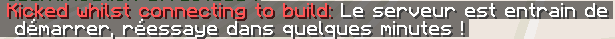

    
    <h1>Welcome to SleepingServerStarter 💤</h1>
    

    Put your minecraft server to rest, while SleepingServerStarter is watching! Save power, save the world!
    

    

[Tutorial Video](https://youtu.be/WqvQISpr6-s) | [Based on JSPrismarine](https://github.com/JSPrismarine/JSPrismarine) | [Original idea](https://github.com/tustin2121/MCSignOnDoor)
    

## 🧰 Features

- Listen on the same port as your minecraft server.
  - Option to connect from BedRock *(Portable version of Minecraft)*
  - Web-gui, to turn on or off your server from anywhere
- When someone connects, immediately launch your minecraft server

**Works better with [EmptyServerStopper](https://www.spigotmc.org/resources/emptyserverstopper.19409/), a plugin that automatically stops your server after a definied amount of time**

## 📀 Install

There are two ways to run SleepingServerStarter :

### Download the binaries

1. [Download binaries](https://github.com/vincss/mcsleepingserverstarter/releases/latest) corresponding to your OS
2. Place the executable in the same folder as your server file (`spigot.jar`, `paper.jar`, etc...)
3. Make sure your server is stopped
4. Run the executable
    - On Linux, try `chmod +x sleepingServerStarter.run` if you can't run the executable

### Manually install and compile

0. Requires [NodeJS](https://nodejs.org/en/) v16+
1. Clone the repo or download the project as Zip
2. Unzip or clone it **in the same folder as your minecraft server**
3. Launch `npm install`
4. Start the project with `npm start`

## ⚙️ Settings
> Note: If running from binaries, the settings file will be created after the first execution in the same folder as the executable

| Setting                     | Description                                                                                                                                                     | Default value                                   |
|-----------------------------|-----------------------------------------------------------------------------------------------------------------------------------------------------------------|-------------------------------------------------|
| `serverName`                | The name of your server                                                                                                                                         | "SleepingServer, waiting for his prince..."     |
| `serverPort`                | The port of your Java Edition server (0 to disable)                                                                                                                           | 25565                                           |
| `bedrockPort`               | The port of your Bedrock Edition server (0 to disable)                                                                                                                        | 19132                                           |
| `loginMessage`              | Message shown when the server is off and someone is trying to connect                                                                                           | "...Waking server up, come back in a minute..." |
| `serverOnlineMode`          | Check if players has premium accounts                                                                                                                           | true                                            |
| `maxPlayers`                | Maximum amount of players                                                                                                                                       | 20                                              |
| `webPort`                   | Port for the Web-Gui (0 to disable)                                                                                                                             | 0                                               |
| `startMinecraft`            | Start the Minecraft Server (0 to disable)                                                                                                                       | 1                                               |
| `minecraftCommand`          | The command used to start the server                                                                                                                            | "java -jar paper.jar nogui"                     |
| `minecraftWorkingDirectory` | Set a custom Working Directory for the server **EDIT ONLY IF YOU KNOW WHAT YOU'RE DOING** (should be the path to the server's directory, absolute path is best) | ""                                              |
| `version`                   | Force compatibility with a specific Minecraft version                                                                                                           | ""                                              |
| `favIcon`                   | Use a custom server-icon 64x64 png converted using https://www.base64-image.de/ (needs to be encoded in base64)                                                 | ""                                              |
| `discordWebhookUrl`                   | Setup a [Discord WebHook](https://support.discord.com/hc/en-us/articles/228383668-Intro-to-Webhooks) to your channel | "REPLACE_ME"  
-----

#### Use WebServer for dynmap :
- You need to change your configuration from class: `org.dynmap.InternalClientUpdateComponent` to class `org.dynmap.JsonFileClientUpdateComponent` *(comment all the section InternalClientUpdateComponent and uncomment JsonFileClientUpdateComponent)*
- Chat will not work when hosted by mcsleepingserverstarter. For a full compatibilty, you can use an apache server *(https://github.com/webbukkit/dynmap/wiki/Setting-up-without-the-Internal-Web-Server)*

#### Links :
- Icons: https://www.flaticon.com/free-icon/geyser_1842245
- Image encoder: https://www.base64-image.de/

## 🕸 Bungeecord

While SleepingServerStarter is made to run on a single server, it can be integrated to a Bungeecord network. **But please note that you'll need to install and configure SleepingServerStarter on every servers you want to be affected by the program.**

Installing SleepingServerStarter only on your proxy server <u>**will NOT work**</u>

For each server you're installing SleepingServerStarter on :
- the `serverPort` should be the port of the server you're installing the program on, not the proxy's port
- make sure `serverOnlineMode` is set to `false` to avoid any problems with Bungee when switching between servers

We know this can be a little bit time consuming, but this solution is working great

#### In action :

When trying to join a sleeping server, you get this kind of message by Bungee 
Basically, it keeps kicking the player with `loginMessage` as reason, telling the player the server is being started

## 👤 Author

**[@vincss](https://github.com/vincss)**

## 🤝 Contributing

Contributions, issues and feature requests are welcome! Feel free to check [issues page](https://github.com/vincss/mcsleepingserverstarter/issues)

## 🙌 Show your support

Give a ⭐️ if you like the project!

## 📜 ChangeLog  
  * 1.1.0 - 1.17.1 : 
    * **Feature** Add Discord Notification
    * Update dependencies (node16, npm8, typescript,...)
  * 1.0.4 - 1.17.1 : 
    * update node-minecraft-protocol ^1.26.1
  * 1.0.3 - 1.16.5 : 
    * update security
  * 1.0.2 - 1.16.5 : 
    * add maxPlayers in settings 
  * 1.0.1 - 1.16.5 : 
    * Include version in log.
  * 1.0.0 - 1.16.5 : 
    * **Feature** Add web-gui
  * 1.16.4 :
    * Add bedrock support.
  * ...